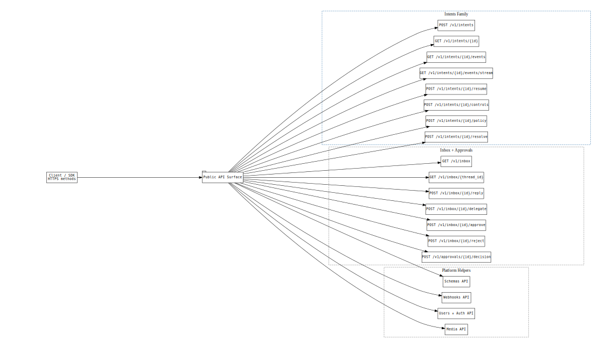

# axme-sdk-go

**Official Go SDK for the AXME platform.** Send and manage intents, poll lifecycle events and history, handle approvals and inbox operations, and access the full enterprise admin surface — idiomatic Go, context-aware, no dependencies beyond the standard library.

> **Alpha** · API surface is stabilizing. Not recommended for production workloads yet.  
> Alpha access: https://cloud.axme.ai/alpha · Contact and suggestions: [hello@axme.ai](mailto:hello@axme.ai)

---

## What Is AXME?

AXME is a coordination infrastructure for durable execution of long-running intents across distributed systems.

It provides a model for executing **intents** — requests that may take minutes, hours, or longer to complete — across services, agents, and human participants.

## AXP — the Intent Protocol

At the core of AXME is **AXP (Intent Protocol)** — an open protocol that defines contracts and lifecycle rules for intent processing.

AXP can be implemented independently.  
The open part of the platform includes:

- the protocol specification and schemas
- SDKs and CLI for integration
- conformance tests
- implementation and integration documentation

## AXME Cloud

**AXME Cloud** is the managed service that runs AXP in production together with **The Registry** (identity and routing).

It removes operational complexity by providing:

- reliable intent delivery and retries  
- lifecycle management for long-running operations  
- handling of timeouts, waits, reminders, and escalation  
- observability of intent status and execution history  

State and events can be accessed through:

- API and SDKs  
- event streams and webhooks  
- the cloud console

---

## What You Can Do With This SDK

- **Send intents** — create typed, durable actions with delivery guarantees
- **Poll lifecycle events** — retrieve real-time state events and intent history via `ListIntentEvents`
- **Approve or reject** — handle human-in-the-loop steps from Go services
- **Control workflows** — pause, resume, cancel, update retry policies and reminders
- **Administer** — manage organizations, workspaces, service accounts, and grants

---

## Install

```bash
go get github.com/AxmeAI/axme-sdk-go@latest
```

Go modules are published by git tag and module path (no separate central package name). The import package remains `axme`.

---

## Quickstart

```go
package main

import (
    "context"
    "fmt"
    "log"

    "github.com/AxmeAI/axme-sdk-go/axme"
)

func main() {
    client, err := axme.NewClient(axme.ClientConfig{
        APIKey:  "AXME_API_KEY",  // sent as x-api-key
        ActorToken: "OPTIONAL_USER_OR_SESSION_TOKEN", // sent as Authorization: Bearer
        // Optional override (defaults to https://api.cloud.axme.ai):
        // BaseURL: "https://staging-api.cloud.axme.ai",
    })
    if err != nil {
        log.Fatal(err)
    }

    ctx := context.Background()

    // Check connectivity / discover available capabilities
    capabilities, err := client.GetCapabilities(ctx, axme.RequestOptions{})
    if err != nil {
        log.Fatal(err)
    }
    fmt.Println(capabilities)

    // Send an intent
    intent, err := client.CreateIntent(ctx, map[string]any{
        "intent_type":  "order.fulfillment.v1",
        "payload":      map[string]any{"order_id": "ord_123", "priority": "high"},
        "owner_agent":  "agent://fulfillment-service",
    }, axme.RequestOptions{IdempotencyKey: "fulfill-ord-123-001"})
    if err != nil {
        log.Fatal(err)
    }
    fmt.Println(intent["intent_id"], intent["status"])
}
```

---

## Minimal Language-Native Example

Short basic submit/get example:

- [`examples/basic_submit.go`](examples/basic_submit.go)

Run:

```bash
AXME_API_KEY="axme_sa_..." go run ./examples/basic_submit.go
```

Full runnable scenario set lives in:

- Cloud: <https://github.com/AxmeAI/axme-examples/tree/main/cloud>
- Protocol-only: <https://github.com/AxmeAI/axme-examples/tree/main/protocol>

---

## API Method Families

The SDK covers the full public API surface:



*D1 families (intents, inbox, approvals) are the core integration path. D2 adds schemas, webhooks, and media. D3 covers enterprise admin. The Go SDK implements all three tiers.*

---

## Error Model and Retriability

The Go SDK maps platform error codes to typed errors. Use the error model to decide whether to retry:


*`4xx` client errors are wrapped in `AxmeClientError` — do not retry. `5xx` errors are `AxmeServerError` — safe to retry with the original idempotency key. The `RetryAfter` field provides the wait hint.*

```go
intent, err := client.CreateIntent(ctx, payload, opts)
if err != nil {
    var apiErr *axme.AxmeAPIError
    if errors.As(err, &apiErr) && apiErr.Retriable {
        time.Sleep(apiErr.RetryAfter)
        // retry...
    }
}
```

---

## Approvals

```go
inbox, err := client.ListInbox(ctx, "agent://manager", axme.RequestOptions{})
if err != nil {
    log.Fatal(err)
}

items, _ := inbox["items"].([]any)
for _, item := range items {
    entry, ok := item.(map[string]any)
    if !ok {
        continue
    }
    threadID, ok := entry["thread_id"].(string)
    if !ok || threadID == "" {
        continue
    }
    _, err = client.ApproveInboxThread(
        ctx,
        threadID,
        map[string]any{"note": "LGTM"},
        "agent://manager",
        axme.RequestOptions{},
    )
    if err != nil {
        log.Fatal(err)
    }
}
```

---

## Enterprise Admin APIs

The Go SDK includes the full service-account lifecycle surface:

```go
// Create a service account
sa, _ := client.CreateServiceAccount(ctx, map[string]any{
    "name": "ci-runner",
    "org_id": "org_abc",
}, axme.RequestOptions{IdempotencyKey: "sa-ci-runner-001"})

// Issue a key
key, _ := client.CreateServiceAccountKey(ctx, sa["id"].(string), map[string]any{}, axme.RequestOptions{})

// List all service accounts
list, _ := client.ListServiceAccounts(ctx, "org_abc", "", axme.RequestOptions{})

// Revoke a key
client.RevokeServiceAccountKey(ctx, sa["id"].(string), key["key_id"].(string), axme.RequestOptions{})
```

Available methods:
- `CreateServiceAccount` / `ListServiceAccounts` / `GetServiceAccount`
- `CreateServiceAccountKey` / `RevokeServiceAccountKey`

---

## Nick and Identity Registry

```go
// Register a user identity
registered, _ := client.RegisterNick(ctx,
    map[string]any{"nick": "@partner.user", "display_name": "Partner User"},
    axme.RequestOptions{IdempotencyKey: "nick-register-001"},
)

// Check existence
check, _ := client.CheckNick(ctx, "@partner.user", axme.RequestOptions{})

// Rename
renamed, _ := client.RenameNick(ctx,
    map[string]any{"owner_agent": registered["owner_agent"], "nick": "@partner.new"},
    axme.RequestOptions{IdempotencyKey: "nick-rename-001"},
)
```

---

## Repository Structure

```
axme-sdk-go/
├── axme/
│   ├── client.go              # AxmeClient — all API methods
│   └── config.go              # ClientConfig and RequestOptions
├── examples/
│   └── basic_submit.go        # Minimal language-native quickstart
└── docs/
    └── diagrams/              # Diagram copies for README embedding
```

---

## Tests

```bash
go test ./...
```

---

## Related Repositories

| Repository | Role |
|---|---|
| [axme-docs](https://github.com/AxmeAI/axme-docs) | Full API reference and integration guides |
| [axme-spec](https://github.com/AxmeAI/axme-spec) | Schema contracts this SDK implements |
| [axme-conformance](https://github.com/AxmeAI/axme-conformance) | Conformance suite that validates this SDK |
| [axme-examples](https://github.com/AxmeAI/axme-examples) | Runnable examples using this SDK |
| [axme-cli](https://github.com/AxmeAI/axme-cli) | CLI tool built on top of this SDK |
| [axme-sdk-python](https://github.com/AxmeAI/axme-sdk-python) | Python equivalent |

---

## Contributing & Contact

- Bug reports and feature requests: open an issue in this repository
- Alpha access: https://cloud.axme.ai/alpha · Contact and suggestions: [hello@axme.ai](mailto:hello@axme.ai)
- Security disclosures: see [SECURITY.md](SECURITY.md)
- Contribution guidelines: [CONTRIBUTING.md](CONTRIBUTING.md)
